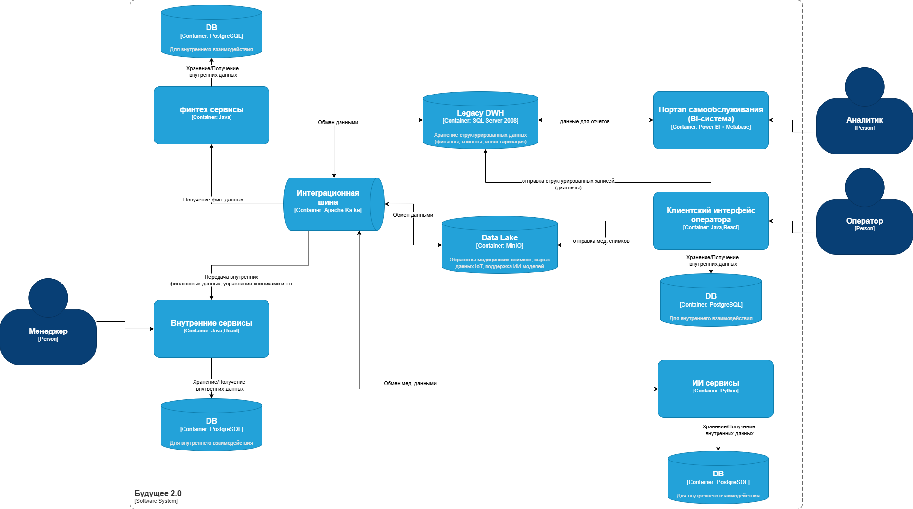

# Задание 1
## Диаграмма контейнеров (финальное состояние через год)

## Анализ проблемных мест
| Проблема                     | Описание                                                                                                                                   |
|------------------------------|--------------------------------------------------------------------------------------------------------------------------------------------|
| Устаревший DWH                | Microsoft SQL-сервер 2008 морально устарел и снят с поддержки                     |
| Реализация большого количества бизнес-логики в DWH    | Большое количество бизнес-логики реализовано в DWH, что вызывает сложности при масштабировании и подключении новой функциональности                                    |
| Одно хранилище для всех типов данных    | Все данные, в том числе используемые для BI- и AI-сервисов, используют одну DWH, что уже вызывает проблемы с производительностью                                    |
| Старая шина данных           | Интеграционная шина данных на основе Apache Camel недостаточно масштабируема и требует постоянных обновлений со стороны команды разработки |
| Сложности с отчётами         | Сложные отчёты можно ждать часами из-за большого количества трансформаций                                                                  |
| Проблемы безопасности данных    | Отсутствие централизованного управления доступами, хранение данных не соответствует принципам Privacy By Design                                                                                          |

## Приоритезация выявленных проблем по MoSCoW
| Категория | 	Проблема                  | Обоснование                                                                                   |
|-----------|----------------------------|-----------------------------------------------------------------------------------------------|
| Must      | Одно хранилище для всех типов данных        | ля разных задач (аналитика, ИИ-сервисы) необходимы разные наборы и форматы данных. В случае одного общего хранилища это требует большого количества трансформаций                                    |
| Must      | Сложности с отчётами       | Прямое требование бизнеса. Задержка отчётности может привести к финансовым и юридическим последствиям |
| Should    | Старая шина данных         | Повышение масштабируемости и надёжности интеграции                                            |
| Should     | Проблемы безопасности данных  | Важно для долгосрочной надёжности                                                             |
| Could     | Реализация большого количества логики в DWH | Можно решить позже при внедрении новых инструментов                |
| Won't      | Устаревший DWH              | Низкая производительность, риски безопасности. Рекомендуется миграции на MS SQL-сервер 2022, но, в связи с большим объёмом работ по миграции проще будет развернуть новое хранилище и постепенно переносить в него новые данные, с учётом предыдущей проблемы                               |