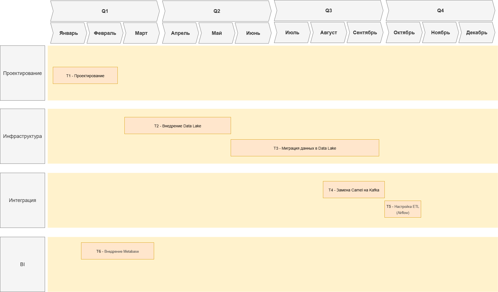

# Обоснование изменений

## Проектирование
### Причины
- Требуется тщательное планирование изменений для такого крупного бизнеса с длинной историей
### Результат
- Обеспечивает независимость развития бизнес-направлений за счёт чёткого определения границ доменов
- Позволяет минимизировать изменения в Legacy DWH

## Внедрение Data Lake
### Причины
- DWH перегружен бинарными данными
- Нет гибкости для ИИ/ML-моделей (сырые данные недоступны)
### Результат изменений
- Снижение нагрузки на DWH.
- Возможность использовать ИИ-модели напрямую с данными из Data Lake.

## Миграция данных в Data Lake
### Причины
- SQL Server 2008 не поддерживает современные функции и морально устарел.
### Результат изменений
- Постепенно снижает зависимость от устаревшего SQL Server
- Упрощает долгосрочную поддержку хранилища

## Замена Camel на Kafka
### Причины
- Низкая пропускная способность
- Нет поддержки потоковой обработки
### Результат изменений
- Увеличение пропускной способности
- Готовность к масштабированию

## Настройка ETL (Airflow)
### Причины
- Жёстко зашитая система распределения данных по разным хранилищам может стать препятствием для быстрого внедрения изменений
### Результат изменений
- Автоматизация задач сбора данных
- Быстрая реакция на изменения бизнес-процесоов

## Портал самообслуживания (Power BI + Metabase)
### Причины
- Зависимость от IT для создания отчётов
- Кастомизированные BI-решения сложно поддерживать.
### Результат изменений
- Сокращение времени на создание отчётов
- Возможность для бизнес-пользователей самостоятельно строить дашборды.